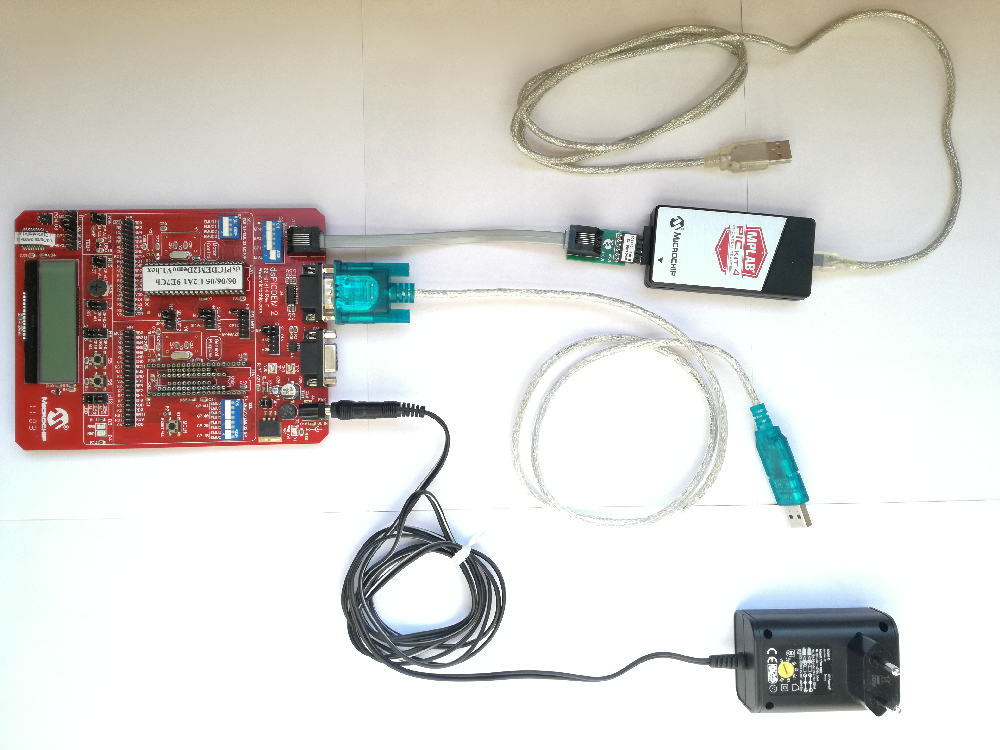

# Autonomous Catamaran

The aim of this project is to implement a basic control system for an autonomous catamaran using [DsPICDEM 2 Development board](https://github.com/cesca95/AutonomousCatamaran/blob/master/docs/dsPICDEM2.pdf).

  

A microcontroller board is connected to two outboard motors. Each outboard motor is composed by a DC motor and a propeller installed at the end of its shaft. Together, the two outboard motors allow the catamaran to move and rotate in the water. The microcontroller receives desired reference values for the rotation speed of the motors from a control PC, in terms of motor RPMs (rounds per minute). These
reference signals are sent through a serial interface. The microcontroller sends a feedback messages back to the control PC to report a few status information.

## About the project 
### Hardware specifications

- Each motor can run from -10000 to +10000 RPMs
- The RPM are controlled through a PWM signal.
  - The frequency must be 1 kHz.
  - 50% duty cycle corresponds to 0 RPM, 0% corresponds to -10000 RPM and 100% corresponds to 10000 RPMs.
- The propeller installed on the shaft of each motor is rated for maximum RPMs of +-8000. Running the motor above +-8000 RPMs might damage the propeller and must be avoided.

### Software requirements

- The control system must never generate PWM signals outside of the specifications of the motor and its propeller.
  - If any reference value is given outside the specifications, the system should saturate it to the minimum/maximum allowed value.
- If no references are received from the PC for more than 5 seconds, the firmware should enter a **timeout mode**:
  - Both motors velocity should be set to zero.
  - Led D4 should blink to signal timeout.
  - When a new reference is read, then the led D4 should stop blinking and commands should be given again to the motor.
- The firmware must support receiving references at least at 10 Hz frequency (**HLREF**).
- The firmware must refresh the PWM value at least at 10 Hz frequency.
- The firmware must acquire the temperature sensor at 10 Hz frequency and average the last 10 readings. The averaged value is sent to the PC at 1 Hz frequency with the **MCTEM** message.
- The firmware must send the feedback message **MCFBK** at 5 Hz frequency.
- The control system should blink led D3 at 1 Hz to signal a correct functioning of the main loop at all times, regardless of any state.
- The user can set new minimum and maximum values through a dedicated command (**HLSAT**):
  - The firmware must check that these values are within the allowed range of the propeller.
  - The firmware must check that the min, max values are correctly set (i.e., min < max).
  - The zero value should be always allowed (i.e. min <= 0 and max >= 0).
    - If the above conditions are not met, the new values are not applied, and the firmware sends a negative ack message.
    - Otherwise, the new values are stored, the PWM is refreshed to comply with the new saturation values, and a positive ack is sent.
- Given the chosen UART baudrate, the firmware should never lose a message due to its implementation, even with full use of the bandwidth.
- If button S5 is pressed, the firmware should enter a **safe mode**:
  - Motors are stopped immediately and reference signals are ignored until the microcontroller receives an enable message (**HLENA**).
  - After exiting safe mode, the motors should be set to zero. Motors should move only after receiving a new reference. Once an enable command is received, the firmware should send a positive ack to the PC.
- The firmware should write on the LCD
  - First row: “STA: x TEM: y”, where x = H/T/C (halt/timeout/controlled), and y is the temperature (e.g. “STA: C TEM: 22.3”)
  - Second row: “RPM: n1,n2”, where n1 and n2 are the applied RPM (e.g. “RPM: -1000,-2000”)
  - If the button S6 is pressed, the data displayed on the LCD changes as follows:
    - First row: “SAT MIN: x MAX: y”, where x and y are the minimum and maximum current saturation values set
    - Second row: “RPM: PDC1,PDC2”, where PDC1 and PDC2 are the values of the duty cycle PWM registers
  - If the button S6 is pressed again, the data displayed toggles again to the first one.

### Messages from the PC
- <code> <b> $HLREF,n1,n2\* </b> </code>  where *n1* and *n2* are the RPMs for the left and right motors respectively.
- <code> <b> $HLSAT,min,max* </b> </code> where min and max represent the minimum and maximum RPMs allowed.
- <code> <b> $HLENA* </b> </code> enables the firmware to send references to the motors (to exit safe mode)

### Feedback to the PC
- <code> <b> $MCFBK,n1,n2,state* </b> </code> where *n1* and *n2* are the applied reference signals and state is 2 if the microcontroller is in safe mode, 1 if it is in timeout mode, 0 otherwise.
- <code> <b> $MCTEM,temp* </b> </code> where *temp* is the temperature
- <code> <b> $MCACK,msg\_type,value* </b> </code> where msg_type is the command (e.g. ENA, SAT), and value is 1 if the message was applied and 0 otherwise (example: $MCACK,SAT,0* for a negative ack to the saturation command)

### Summary microcontroller modes

| Mode        	| Letter | Effect  |
| :-----------: |:------:| :------|
| Controlled    | C 	 | Motors velocity are set equal to *n1* and *n2* for left motor and right one respectivelly |
| Time out      | T      | No **HLREF** messages are received from the PC for more than 5 seconds so both motors velocity are set to zero |
| Safe mode 	| H      | Motors are stopped immediately and new reference signals are ignored until the microcontroller receives the enable message from the PC |

## Getting Started
### Host system requirements

- PC-compatible system with an Interl class processor, or equivalent
- A minimum of 16 MB RAM
- A minimum fo 40 MB available hard drive space 

### Software Prerequisite

- **MPBLAB X IDE** for programming the board  
  *If you don't have already it on your PC you can download it [here](https://www.microchip.com/mplab/mplab-x-ide) for free.*

### Set up

1) Check the 

  

  

## Authors

* **Francesca Cantoni:** 	francescacantoni95@gmail.com
* **Kenza Boubakri:** 		kenza.boubakri@gmail.com 

