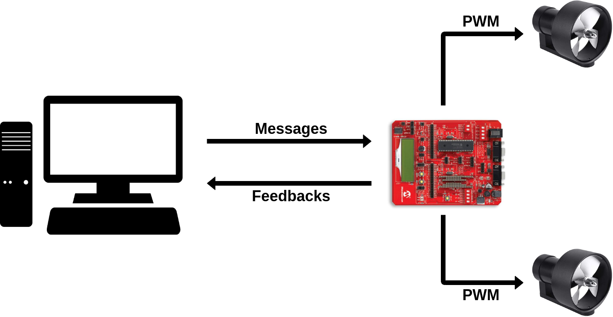

# Autonomous Catamaran

The aim of this project is to implement a basic control system for an autonomous catamaran using [DsPICDEM 2 Development board](https://github.com/cesca95/AutonomousCatamaran/blob/master/docs/dsPICDEM2.pdf).

  

A microcontroller board is connected to two outboard motors. Each outboard motor is composed by a DC motor and a propeller installed at the end of its shaft. Together, the two outboard motors allow the catamaran to move and rotate in the water. The microcontroller receives desired reference values for the rotation speed of the motors from a control PC, in terms of motor RPMs (rounds per minute). These
reference signals are sent through a serial interface. The microcontroller sends a feedback messages back to the control PC to report a few status information.

## Getting Started

### Host system requirements

- PC-compatible system with an Interl class processor, or equivalent
- A minimum of 16 MB RAM
- A minimum fo 40 MB available hard drive space 

### Software Prerequisite

- **MPBLAB X IDE** for programming the board  

  *If you don't have already on your PC you can download it [here](https://www.microchip.com/mplab/mplab-x-ide) for free.*

## Authors

* **Francesca Cantoni:** 	francescacantoni95@gmail.com
* **Kenza Boubakri:** 		kenza.boubakri@gmail.com 

