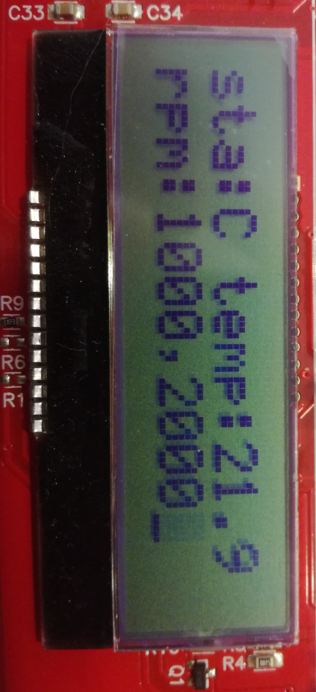
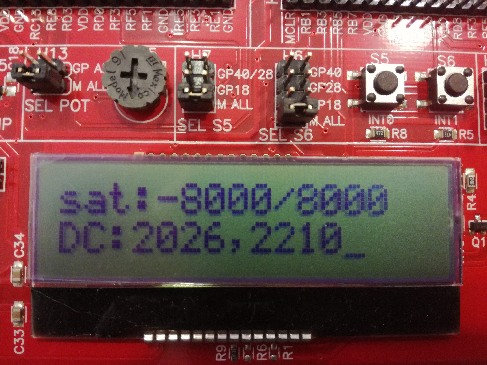
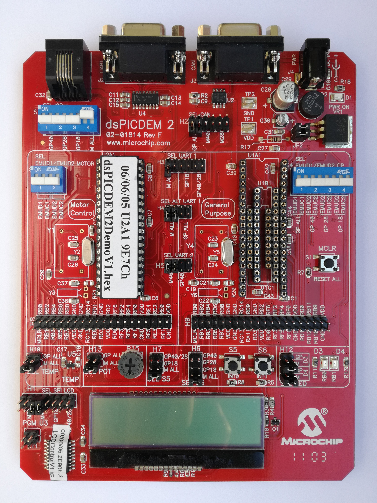
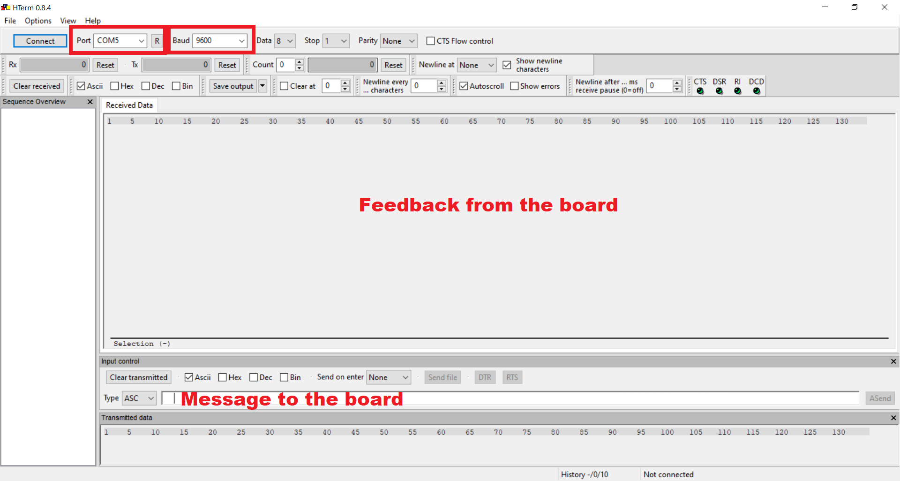
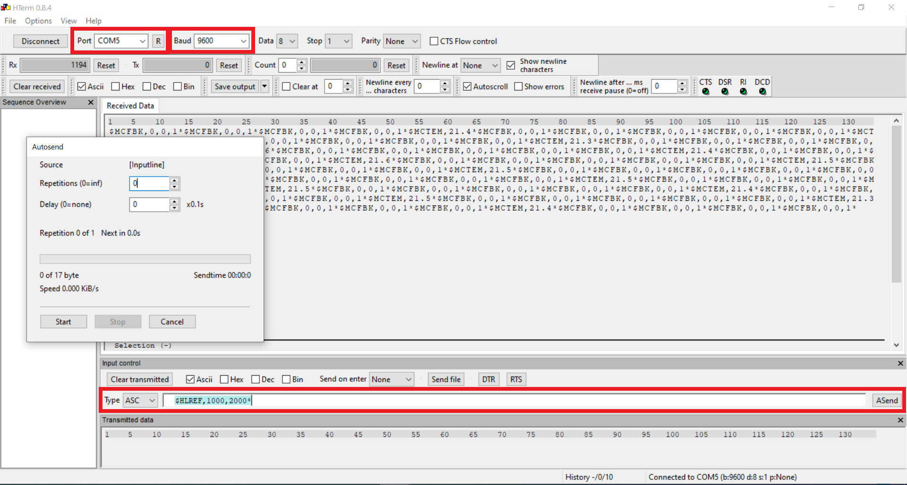

# Autonomous Catamaran

The aim of this project is to implement a basic control system for an autonomous catamaran using [DsPICDEM 2 Development board](https://github.com/cesca95/AutonomousCatamaran/blob/master/docs/dsPICDEM2.pdf).

<p align="center">
  
</p>

A microcontroller board is connected to two outboard motors. Each outboard motor is composed of a DC motor and a propeller installed at the end of its shaft. Together, the two outboard motors allow the catamaran to move and rotate in the water. The microcontroller receives desired reference values for the rotation speed of the motors from a control PC, in terms of motor RPMs (rounds per minute). These
reference signals are sent through a serial interface. The microcontroller sends feedback messages back to the control PC to report a few status information.

## About the project 
### Hardware specifications

- Each motor can run from -10000 to +10000 RPMs
- The RPMs are controlled through a PWM signal
  - The frequency must be 1 kHz
  - 0% duty cycle (DC) corresponds to -10000 RPMs, 50% DC corresponds to 0 RPM, and 100% DC corresponds to 10000 RPMs
- The propeller installed on the shaft of each motor is rated for maximum RPMs of +-8000. **Running the motor above +-8000 RPMs might damage the propeller and must be avoided**

### Software requirements

##### A. Check correct functioning
- The control system should blink **led D3** at 1 Hz to signal a correct functioning of the main loop at all times, regardless of any state of the board

##### B. Communication
- Given the chosen UART baudrate, the firmware should never lose a message due to its implementation, even with full use of the bandwidth

##### C. Possible status of the control system

| State        	| Symbol | Effect  |
| :-----------: |:------:| :------:|
| Controlled    | C 	 | Motors velocity are set to *n1* and *n2* for the left and right motor respectively |
| Time out      | T      | Both motors velocity are set to zero because none references were received from the control PC for more than 5 seconds|
| Safe mode 	| H      | Motors are stopped immediately and new reference signals are ignored until the microcontroller receives the enable message from the control PC |

###### C.1 Control mode
- The firmware must support receiving references (**HLREF**) at least at 10 Hz frequency: 
- The control system must never generate PWM signals outside of the specifications of the motor and its propeller
  - If any reference value is given outside the specifications, the system should saturate it to the minimum/maximum allowed value
- The firmware must refresh the PWM value at least at 10 Hz frequency
- The user can set new minimum and maximum values through a dedicated command (**HLSAT**):
  - The firmware must check that these values are within the allowed range of the propeller
  - The firmware must check that the min, max values are correctly set (i.e., min < max)
  - The zero value should be always allowed (i.e. min <= 0 and max >= 0)
    - If the above conditions are not met, the new values are not applied, and the firmware sends a negative ack message
    - Otherwise, the new values are stored, the PWM is refreshed to comply with the new saturation values, and a positive ack is sent

###### C.2 Timeout mode
- If no references are received from the PC for more than 5 seconds, the firmware should enter a **timeout mode**:
  - Both motors velocity should be set to zero
  - **Led D4** should blink to signal timeout
  - When a new reference is read, then the led D4 should stop blinking and commands should be given again to the motor

###### C.3 Safe mode
- If **button S5** is pressed, the firmware should enter a **safe mode**:
  - Motors are stopped immediately and reference signals are ignored until the microcontroller receives an enable message (**HLENA**):
  - After exiting safe mode, the motors should be set to zero. Motors should move only after receiving a new reference
  - Once an enable command is received, the firmware should send a positive ack to the PC


##### D. Display  

- The firmware should write on the LCD different information based on the current modality:
  - **First modality**:

| Row        	  | Information 		| Explanation  								| 
| :-----------: |:---------------------:| :---------------------------------------------------------------------:|
| First    	    | **sta: x temp: y** 	| *x* = H/T/C (halt/timeout/controlled), and *y* is the temperature 	| 
| Second      	| **rpm: n1,n2**     	| *n1* and *n2* are the applied RPMs 					| 

<p align="center">
  
</p>

  - If the **button S6** is pressed, the LCD should change into **second modality**:

| Row        	  | Information 			 | Explanation  								| 
| :-----------: |:------------------------------:| :-------------------------------------------------------:			|
| First    	    | **sat: x/y**			 | *x* and *y* are the minimum and maximum current saturation values set	| 
| Second      	| **rpm: PDC1,PDC2**    	 | *PDC1* and *PDC2* are the values of the duty cycle PWM registers		| 

<p align="center">
  
</p>

##### D. Feedback to the PC
- The firmware must acquire the temperature sensor at 10 Hz frequency and average the last 10 readings. The averaged value is sent to the PC at 1 Hz frequency with the **MCTEM** message
- The firmware must send the feedback message **MCFBK** at 5 Hz frequency
- The firmware must send a feedback message **MACK** as a response to the message received

**NOTE:** For more details about the messages and the feedbacks check the dedicated sections "**Messages from the control PC to the board**" and "**Feedbacks from the board to the control PC**"

## Getting Started
### Host system requirements

- PC-compatible system with an Intel class processor, or equivalent
- A minimum of 16 MB RAM
- A minimum of 40 MB available hard drive space 

### Software Prerequisite

- **MPBLAB X IDE** 	&nbsp; *If you don't have it already on your PC, download [here](https://www.microchip.com/mplab/mplab-x-ide) for free*
- **MPBLAB XC16 Compiler**  &nbsp;	*If you don't have it already on your PC, download [here](https://www.microchip.com/mplab/compilers) for free*

### Set up

1. Check that the board has all the jumpers and switches in the same position as the yellow rectangles in the image below

<p align="center">
  
</p>

2. Attach all the cables to the board as depicted in the following image <br>

**REMARK:** In case of **PICK Kit 4** pay attention to connect the first pin on the right of **ICD-2** to the hole with the down arrow of the PICK


<p align="center">
  
</p>


3. Attach the 2 USB ends with the USB ports of your PC and battery charger to the power outlet 

4. Attach the motors into **H8** as follows: 

      | Motor        	| PWM pin 			|
      | :-----------: |:-----------------------------:| 
      | Left    	| RE1		 		| 
      | Right      	| RE3    			| 


**NOTE:** For more information about the connections check [dsPICDEM2_drawings.pdf](https://github.com/cesca95/AutonomousCatamaran/blob/master/docs/dsPICDEM2_drawings.pdf) file


## How to run it

1.  Clone the repository in your computer through the command:

    ```bash
    git clone https://github.com/cesca95/AutonomousCatamaran.git
    ```
2. Create a new project in **MPBLAB X IDE** and add the files contained in **code** folder into the **src** folder of your new project
3. Check that the project that you want to upload on the board is in bold, otherwise:
   - Right click of your mouse on the project name
   - Click on: *Set as main project*
4. Upload the code on your board via upload icon   
5. Run the executable file *hterm.exe* 

<p align="center">
  
</p>

  - Change the UART baudrate from **115200** bps to **9600** bps
  - Click on **Connect** botton

## How to use it
### Simulate safe mode
To simulate the **safe mode** you have to press **button S5**
### Messages from the control PC to the board
You have these three different types of messages to control the catamaran:

| Message        			   | First parameter 	   	   	| Second parameter       		| Third parameter	|
| :---------------------------------------:|:---------------------:	   	| :---------------------:		|:---------------------:|
| <code> <b> $HLREF,n1,n2* </b> </code>   | To send the reference values  	| *n1* is the RPM for the left motor 	| *n2* is the RPM for the right motor |
| <code> <b> $HLSAT,min,max* </b> </code>  | To change the saturation values 	| *min* is the minimum RPM allowed 	| *max* is the maximum RPM allowed|
|  <code> <b> $HLENA* </b> </code> 	   | To exit safe mode 			| 					| 					|

### Feedbacks from the board to the control PC
You are going to receive these three different types of feedback based on the message that you have sent via the control PC:
| Message        			   	| First parameter 	   	   	| Second parameter       		| Third parameter	| Fourth parameter 
| :---------------------------------------:	|:---------------------:	   	| :---------------------:		|:---------------------:|:---------------------:|
| <code> <b> $MCFBK,n1,n2,state* </b> </code>   | Feedback to HLREF message  | *n1* is the applied reference signal for left motor| *n2* is the applied reference signal for right motor  | *state* is 2 if the microcontroller is in safe mode, 1 if it is in timeout mode, 0 otherwise |
| <code> <b> $MCTEM,temp* </b> </code>  	| Feedback to know the temperature of the board |  | |	|
| <code> <b> $MCACK,msg\_type,value* </b> </code>| Acknowledgment feedback| *msg_type* is the command (e.g. REF, ENA, SAT)| *value* is 1 if the message was applied and 0 otherwise|	|

<p align="center">
  
</p>


## Additional material

For more information about the board consult the materials in the folder **docs** in particular [dsPIC_reference_manual.pdf](https://github.com/cesca95/AutonomousCatamaran/blob/master/docs/dsPIC_reference_manual.pdf) and [dspic30f4011.pdf](https://github.com/cesca95/AutonomousCatamaran/blob/master/docs/dspic30f4011.pdf)

## Authors

* **Francesca Cantoni:** 	francescacantoni95@gmail.com
* **Kenza Boubakri:** 		kenza.boubakri@gmail.com 

